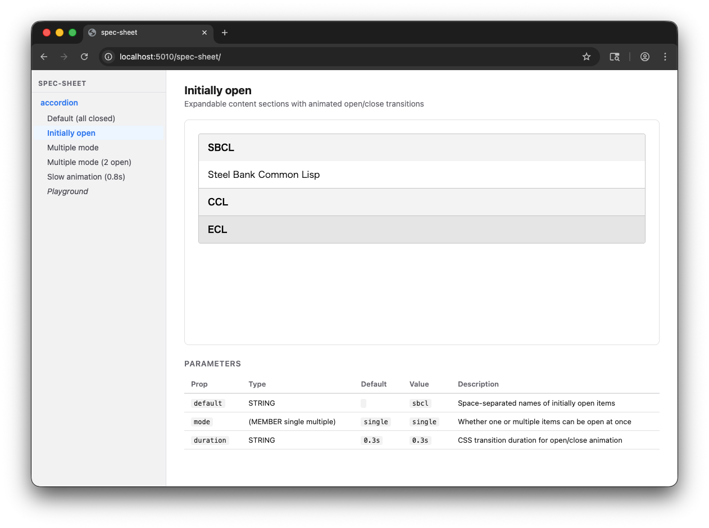

# spec-sheet

A [Storybook](https://storybook.js.org/)-like developer tool for [cl-s3r](https://github.com/tamurashingo/cl-s3r) components.

Define component specifications with `defspec` and parameter variations with `defsheet`, then browse them in a live two-panel UI — sidebar on the left, interactive preview on the right. A built-in **Playground** lets you freely edit any prop and see the result immediately.



## Features

- **Declarative specs** — describe a component's props and a render template with `defspec`
- **Named sheets** — register param variations with `defsheet`; they appear in declaration order
- **Interactive preview** — the component runs with full cl-s3r reactivity inside an isolated iframe
- **Playground** — edit every prop through auto-generated inputs and apply changes live
- **Zero configuration** — one call to `configure-spec-sheet` mounts the UI on any running cl-s3r server

## Requirements

- [cl-s3r](https://github.com/tamurashingo/cl-s3r)
- [Roswell](https://github.com/roswell/roswell) (optional, for the CLI)

## Installation

**As a library:**

```lisp
(ql:quickload :spec-sheet)
```

**As a CLI tool (via Roswell):**

```bash
ros install tamurashingo/spec-sheet
```

Or directly from a local clone:

```bash
ros install /path/to/spec-sheet/roswell/spec-sheet.ros
```

## CLI Usage

Once installed via Roswell, start spec-sheet by passing one or more spec files:

```bash
# Load a single loader file, start on port 5000
spec-sheet ./src/spec-loader.lisp

# Load multiple files in order
spec-sheet ./src/spec-loader.lisp ./src/extra.lisp

# Use a custom port
spec-sheet --port 8080 ./src/spec-loader.lisp
spec-sheet -p 8080 ./src/spec-loader.lisp
```

Open `http://localhost:5000/spec-sheet/` (or the port you chose) in your browser.

The recommended pattern is a single **loader file** that explicitly loads each spec file:

```lisp
;; src/spec-loader.lisp
(load (merge-pathnames "accordion/accordion.lisp" *load-truename*))
(load (merge-pathnames "button/button.lisp"       *load-truename*))
```

This keeps spec definitions in per-component files while giving you full control over what gets loaded.

## Quick Start (as a library)

```lisp
(ql:quickload :spec-sheet)
(ql:quickload :cl-s3r.components.accordion)

(use-package :spec-sheet)

;; 1. Define a spec for a component
(defspec accordion
  :description "Accordion component"
  :component #'cl-s3r.components.accordion:accordion
  :render #'(lambda (&key default mode duration)
              `(accordion (@ (default ,(or default ""))
                             (mode    ,(or mode "single"))
                             (duration ,(or duration "0.3s")))
                 (accordion-item (@ (name "sbcl"))
                   (accordion-header "SBCL")
                   (accordion-panel "Steel Bank Common Lisp"))
                 (accordion-item (@ (name "ccl"))
                   (accordion-header "CCL")
                   (accordion-panel "Clozure Common Lisp"))
                 (accordion-item (@ (name "ecl"))
                   (accordion-header "ECL")
                   (accordion-panel "Embeddable Common Lisp"))))
  :props '((default  :type string
                     :default ""
                     :description "Space-separated names of initially open items")
           (mode     :type (member "single" "multiple")
                     :default "single"
                     :description "Whether one or multiple items can be open at once")
           (duration :type string
                     :default "0.3s"
                     :description "CSS transition duration for open/close animation")))

;; 2. Define sheets (parameter variations)
(defsheet accordion default
  :title "Default behavior"
  :params '())

(defsheet accordion init
  :title "Initially open"
  :params '(:default "sbcl"))

(defsheet accordion multiple
  :title "Multiple mode"
  :params '(:mode "multiple"))

(defsheet accordion slow
  :title "Slow animation"
  :params '(:duration "0.8s"))

;; 3. Mount the spec-sheet UI and start the server
(configure-spec-sheet :path "/spec-sheet")
(cl-s3r.server:run-server)
```

Open `http://localhost:5000/spec-sheet/` in your browser.

## API Reference

### `defspec`

Registers a component specification.

```
(defspec name
  :description string
  :component   function
  :render      lambda
  :props       prop-list)
```

| Argument | Description |
|---|---|
| `name` | A symbol identifying this spec (e.g. `accordion`); used as the sidebar label |
| `:description` | Human-readable description shown in the sheet panel header |
| `:component` | The component function object (e.g. `#'my-package:my-component`) |
| `:render` | A `lambda` taking the spec's props as `&key` args, returning an S-expression |
| `:props` | An ordered list of prop descriptors (see below) |

**Prop descriptor format:**

```lisp
(prop-name :type    type-spec
           :default default-value
           :description "Human-readable description")
```

Supported `:type` values:

| Type | Rendered input |
|---|---|
| `string` | `<input type="text">` |
| `number` | `<input type="number">` |
| `boolean` | `<select>` with `true` / `false` options |
| `(member "a" "b" ...)` | `<select>` |

Re-evaluating `defspec` with the same name updates the spec in place (preserving its position in the list) and resets all its sheets.

### `defsheet`

Registers a parameter variation for an existing spec.

```
(defsheet spec-name sheet-name
  :title  string
  :params plist)
```

| Argument | Description |
|---|---|
| `spec-name` | The name passed to `defspec` |
| `sheet-name` | A symbol identifying this sheet (e.g. `default`, `init`) |
| `:title` | Human-readable title shown in the sidebar and panel header |
| `:params` | A keyword plist of prop values (e.g. `'(:default "sbcl" :mode "multiple")`) |

Sheets are displayed in declaration order. Re-evaluating with the same name updates the sheet in place.

### `configure-spec-sheet`

Registers the spec-sheet routes with the running cl-s3r server.

```lisp
(configure-spec-sheet &key (path "/spec-sheet"))
```

Registers two routes:

| Route | Purpose |
|---|---|
| `PATH/` | Main UI — sidebar + content panel |
| `PATH/preview/` | Isolated component preview loaded inside an iframe |

Call this after all `defspec`/`defsheet` forms and before `cl-s3r.server:run-server`.

### `load-spec-file`

```lisp
(load-spec-file path)
```

Loads a single file containing `defspec`/`defsheet` forms.

### `load-spec-directory`

```lisp
(load-spec-directory dir)
```

Loads all `.lisp` files in `dir` (non-recursively) in alphabetical order.

## UI Overview

```
┌─────────────────┬──────────────────────────────────────────┐
│  spec-sheet     │                                          │
├─────────────────│  Initially open                          │
│  ▸ accordion    │  Expandable content sections with...     │
│    - Default    │                                          │
│    - Initially  │  ┌────────────────────────────────────┐  │
│      open       │  │  SBCL ▼                            │  │
│    - Multiple   │  │  Steel Bank Common Lisp            │  │
│    - Slow       │  │  CCL ▶                             │  │
│    - Playground │  │  ECL  ▶                            │  │
│                 │  └────────────────────────────────────┘  │
│                 │                                          │
│                 │  Parameters                              │
│                 │  Prop      Type    Default  Value        │
│                 │  default   string  ""       "sbcl"       │
│                 │  mode      ...     "single" "single"     │
└─────────────────┴──────────────────────────────────────────┘
```

The sidebar shows the spec **name** (`accordion`). The `:description` appears as a subtitle in the sheet panel header.

The **Playground** sheet renders a live param editor alongside the preview. Changing any input and clicking **Apply** reloads the preview iframe with the new props.

## How It Works

spec-sheet registers two cl-s3r routes:

- **`/spec-sheet/`** renders the `spec-page` component — a stateful component managing sidebar selection and playground params.
- **`/spec-sheet/preview/`** renders the `spec-preview` component — a lightweight wrapper that calls the spec's `:render` lambda and returns the resulting S-expression. Because this route is a top-level cl-s3r component, nested components (like accordion) receive their own `data-state` and are fully interactive.

When a sheet or playground param changes, `spec-page` updates its state and re-renders the iframe `src` attribute. The browser detects the change and loads the new preview URL, giving each preview its own isolated render context and render token.

## Theming

The spec-sheet UI uses CSS custom properties. Override any of these on `.spec-sheet-root`:

| Variable | Default | Description |
|---|---|---|
| `--ss-sidebar-width` | `240px` | Width of the left sidebar |
| `--ss-accent` | `#3b82f6` | Active/highlight colour |
| `--ss-accent-bg` | `#eff6ff` | Active sheet background |
| `--ss-accent-hover` | `#2563eb` | Apply button hover colour |
| `--ss-border` | `#e4e4e7` | Border colour |
| `--ss-sidebar-bg` | `#f4f4f5` | Sidebar background |
| `--ss-text` | `#1a1a1a` | Primary text colour |
| `--ss-muted` | `#71717a` | Secondary/muted text |
| `--ss-preview-bg` | `#fff` | Preview iframe background |
| `--ss-code-bg` | `#f4f4f5` | Code cell background |

## License

MIT — see [LICENSE](LICENSE).
